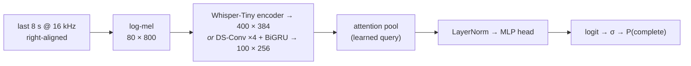

# turn-detector: tiny audio turn detection for Hinglish

**Is the user done speaking, or just pausing?** This is a 7.9M-parameter
audio-only classifier that takes the last 8 seconds of speech and returns
P(turn complete) — the call a voice agent has to make before it starts talking.
It is built for **Indian Hinglish**: code-switched Hindi/English in both
Devanagari and romanized script, Indian-accented prosody, filler words (*haan,
matlab, accha, yaar*) and trailing conjunctions (*…aur*, *…kyunki*). A
Whisper-Tiny baseline trained only on real English and Hindi data scores **63.1%
on held-out Hinglish (n=225)** and gets *complete* Hinglish sentences wrong 84%
of the time (n=75); adding 2,157 synthetic code-switched training clips takes that to
**95.1% (+32.0 points)** with **zero regression** on English (0.938 → 0.938,
n=7,820), Hindi (0.931 → 0.932, n=1,284) or the real-human slice (0.946 →
0.947, n=5,367). Two artifacts ship, both int8 ONNX running on CPU with numpy
and onnxruntime, with no torch and no transformers: the **accurate** 8.5 MB model
(93.8% overall / 95.1% Hinglish) and a **fast** 1.3 MB / ~14 ms distilled
student at 89.6% overall, 507k parameters. The demo exposes both in a dropdown.

The result worth reading twice is the ablation. Dropping pause augmentation
produces a model that is *better* on every static table (96.4% Hinglish vs
95.1%) and **fires on 44.5% of still-speaking clips after a one-second pause**,
against 5.1% for the shipped model. Static test sets cannot see this;
production users feel it immediately. Full write-up in
**[`experiments/REPORT.md`](experiments/REPORT.md)**.

## Live demo

**<https://huggingface.co/spaces/deveshu/hinglish-turn-detector>** runs the
detector **entirely in your browser** via onnxruntime-web (WASM): no inference
server, and recorded audio never leaves your device. This works because the
exported models take a raw waveform and compute the mel spectrogram *inside*
the ONNX graph (`src/turn_detector/melgraph.py` implements the STFT as fixed
DFT convolutions; mel parity with the training frontend is 1e-6 and test AUC is
bit-identical to the shipped models). The page offers:

- microphone, file upload, and six labelled Hinglish example clips, each chip
  showing its ground-truth label next to the model's live verdict with a
  match/miss mark;
- both models in one toggle: **accurate** (Whisper-tiny, 9.3 MB) and **fast**
  (distilled TinyMelNet, 2.0 MB, ~30 ms in-browser);
- a decision readout in plain words (P(complete) vs the tuned threshold), a
  threshold slider that re-scores every example live, and a streaming view of
  P(complete) as the clip plays in.

One caveat the page states itself: the model judges whether the speech *sounds*
finished. It does not know when you pressed stop, and it leans toward waiting,
so a finished sentence can read as "Still speaking". A local Gradio version
with the same models lives in `demo/` (see Quickstart).

## Results

Accuracy at each run's tuned threshold, fp32, on the official
smart-turn v3.2 test split plus a template-disjoint synthetic Hinglish split.

| slice | n | E1 | **E2 shipped** | E3 | **E5 shipped fast** | E6 |
|---|---:|---|---|---|---|---|
| overall | 9,329 | 0.930 | **0.938** | 0.871 | 0.896 | 0.943 |
| english | 7,820 | 0.938 | **0.938** | 0.868 | 0.898 | 0.945 |
| hindi | 1,284 | 0.931 | **0.932** | 0.884 | 0.885 | 0.931 |
| **hinglish** | 225 | 0.631 | **0.951** | 0.871 | 0.871 | 0.938 |
| filler | 2,381 | 0.912 | **0.914** | 0.856 | 0.870 | 0.915 |
| human_audio | 5,367 | 0.946 | **0.947** | 0.877 | 0.904 | 0.954 |
| AUC, hinglish | 225 | 0.612 | **0.986** | 0.949 | 0.962 | 0.963 |
| AUC, overall | 9,329 | 0.981 | **0.983** | 0.944 | 0.959 | 0.986 |
| params | | 7,885,953 | 7,885,953 | 507,265 | 507,265 | 7,885,953 |
| int8 ONNX | | 8.50 MB | 8.50 MB | 1.28 MB | 1.28 MB | 8.50 MB |
| tuned threshold (fp32) | | 0.35 | **0.63** | 0.53 | 0.57 | 0.54 |

- **E1** `e1_baseline`: real English + Hindi only, no augmentation.
- **E2** `e2_hinglish_aug`: E1 data + synthetic Hinglish + pause/silence/noise/speed augmentation. **Shipped: `models/model_int8.onnx`.**
- **E3** `e3_tinymel_scratch`: same data as E2, 507k-param from-scratch mel-CNN + BiGRU. Superseded by E5.
- **E4** `e4_no_pause_aug`: E2 minus pause augmentation; see below.
- **E5** `e5_distill`: E3's architecture distilled from E2's frozen checkpoint (α 0.3, T 2.0). **+2.5 points over E3 at identical size. Shipped: `models/model_tinymel_int8.onnx`.**
- **E6** `e6_full_data`: E2's recipe on 111,509 rows (2.4×: English uncapped, 21-language tail).

Full tables including E4: [`experiments/RESULTS.md`](experiments/RESULTS.md).

**Why E6 is not shipped, despite winning on paper.** It beats E2 overall (0.943
vs 0.938), on English (0.945 vs 0.938) and on the real-human slice (0.954 vs
0.947, AUC 0.990), and **loses on Hinglish** (0.938 vs 0.951, AUC 0.963 vs
0.986). The synthetic Hinglish corpus did not grow with the rest of the data, so
its share of training fell from 4.6% to 1.9% and its influence was diluted out:
scaling 2.4× improved the general case and degraded the target domain. Hinglish
is the brief, so E2 stays, which is also why E2, not E6, is E5's distillation
teacher. Details in [`experiments/REPORT.md`](experiments/REPORT.md) §5.5–5.6.

### Silence stress test: why static accuracy is not enough

Append silence to the 225 Hinglish test clips and re-run. Nothing about what was
said changed, so no verdict should change. E4 scores *higher* than E2 on the
static Hinglish slice (0.964 vs 0.951) and falls apart here.

| | **E2 (with pause aug)** | E4 (no pause aug) |
|---|---|---|
| static hinglish accuracy, fp32 (n=225) | 0.951 | **0.964** |
| decisions flipped by +0.5 s silence | **3.1%** (7/225) | 11.6% (26/225) |
| decisions flipped by +1.0 s silence | **8.4%** (19/225) | 28.9% (65/225) |
| early fires at +0.5 s (incomplete → complete) | **1.5%** (2/137) | 16.8% (23/137) |
| early fires at +1.0 s (incomplete → complete) | **5.1%** (7/137) | 44.5% (61/137) |

An early fire is the agent interrupting the user. At a one-second pause E4 does
it on 61 of the 137 still-speaking clips; E2 does it on 7. Two augmentations
buy this: `pause_cut` (truncate a *complete* utterance mid-speech, append
silence, flip the label to incomplete) and `trailing_silence` (pad any clip,
keep the label). Together they break the "long silence ⇒ done" correlation that
a curated corpus otherwise hands the model for free.

Source: [`experiments/silence_stress_test.json`](experiments/silence_stress_test.json).

### Real-voice spot check (single speaker, phone mic)

30 fresh Hinglish clips (14 complete / 16 incomplete, sentences disjoint from
training) recorded by a real speaker on a phone: **E2 scores 80.0% / AUC 0.942**
at its pre-registered threshold. The gap vs the synthetic 95.1% is honest
domain shift, but its structure is the right one for production: incomplete
detection is 15/16 (trailing fillers 5/5, mid-thought stops 6/6) with **1/16
early-fires after a 1 s real pause**, and five of six errors are completes
called "still speaking" — the model waits too long rather than interrupting.
Single speaker and n=30, so directional evidence, not a benchmark; audio stays
local (only aggregates are committed:
[`experiments/real_voice_eval.json`](experiments/real_voice_eval.json)).

## Quickstart

```bash
# install (Python 3.12)
uv sync

# tests: 43 of them, ~1 min (add -m "not slow" to skip the ONNX export smoke)
uv run python -m pytest -q

# Gradio demo on localhost: record or upload a clip, watch the streaming
# probability curve dip on a filler and recover when the sentence lands
uv run python demo/app.py
```

Inference from Python needs only numpy and onnxruntime:

```python
import numpy as np, soundfile as sf
from turn_detector.infer import TurnDetector

detector = TurnDetector("models/model_int8.onnx", threshold=0.50)   # int8: 0.50
wav, sr = sf.read("demo/examples/incomplete_trailing_aur.flac")  # 16 kHz mono
print(detector.predict(np.asarray(wav, dtype=np.float32)))
# {'prob_complete': ..., 'is_complete': False, 'mel_ms': ..., 'model_ms': ..., 'total_ms': ...}

# the fast variant carries its own threshold
fast = TurnDetector("models/model_tinymel_int8.onnx", threshold=0.57)
```

**Thresholds are per artifact, and quantization moves them.** E2's fp32 operating
point is 0.63, but int8 shifts the probabilities: **0.50 on the int8 file
reproduces the fp32-at-0.63 decision on 99.7% of 600 held-in synthetic clips**
(no test labels used). That resolves an apparent int8 accuracy drop as a
calibration artifact rather than lost separability: int8 AUC 0.978 vs fp32
0.983. `models/metrics.json` records it as `int8_threshold_decision_matched`;
the demo and Space default to it, and to 0.57 for the distilled model.

Latency, int8 ONNX on the dev laptop (onnxruntime CPU, p50 over 100 iterations,
includes numpy mel extraction): **E2 ≈ 91 ms** single-thread, **E5 ≈ 14 ms**
(same architecture and footprint as E3). These are laptop numbers and vary ~35%
between sessions with thermal state; an earlier session measured the small model
at 19 ms. Server CPUs are several times faster, and pipecat's smart-turn v3
reports ~12 ms for the same encoder class. See
[`experiments/REPORT.md`](experiments/REPORT.md) §6.

Training runs on Kaggle (free T4, ~10–32 min per experiment); see
[`KAGGLE_RUNBOOK.md`](KAGGLE_RUNBOOK.md). The expanded E5/E6 prep ships its audio
as 64 ZIP shards because Kaggle's kernel-output publishing silently fails past
~100k loose files; the runbook documents the failure mode and the fix.

## Compute

All six experiments together cost **101.9 minutes of T4 time (1.70 hours)** on a
free Kaggle account, under 6% of one week's free GPU quota. The GPU trains and
does nothing else: the 41 GB source dataset is streamed and filtered in CPU-only
Kaggle sessions and never stored in full, the Hinglish TTS corpus is synthesized
locally, and quantization, ONNX parity, threshold calibration, error analysis,
latency benchmarks, the silence stress test and the real-voice eval all run on a
laptop CPU. Because a Kaggle run killed at the 12 h wall publishes no output at
all, training carries a 10.5 h wall-clock budget, atomic checkpoints every 500
steps and hard-failing resume validation, and the notebooks are generated from
the tested library so no GPU minute is spent on code a CPU smoke test has not
already run. Details, including the per-run breakdown and the fail-fast guards,
in [`experiments/REPORT.md`](experiments/REPORT.md) §9.

## Repo map



```
src/turn_detector/     library: the single source of truth
  common.py            audio constants + right-aligned 8 s windowing (torch-free)
  features.py          Whisper-exact log-mel, torch (parity-tested vs HF)
  infer.py             torch-free numpy mel + ONNX runner + benchmark()
  model.py             WhisperTinyTurn (7.9M) and TinyMelNet (507k)
  augment.py           pause_cut, trailing_silence, noise, speed
  dataset.py           manifest loading + label-flip-aware balanced sampler
  train.py             training loop, slice metrics, threshold tuning, ONNX export
  config.py            E1-E6 experiment definitions (incl. distillation knobs)
synth/                 synthetic Hinglish corpus + edge-tts pipeline
  sentences.py         89 bilingual slot templates, fillers, conjunctions
  corpus.py            template expansion -> corpus_plan.jsonl
  tts_generate.py      edge-tts rendering with word-boundary timestamps
  package_kaggle.py    template-level split (no leakage) -> manifest.parquet
tools/
  build_notebooks.py   generates the Kaggle notebooks from the tested library
  push_kaggle.py       Kaggle CLI driver (prep / train / status / pull / resume)
  aggregate_results.py run_*/metrics.json -> experiments/RESULTS.md
  error_analysis.py    worst errors, per-kind accuracy, threshold sweep, plots
  build_space.py       assembles a deployable torch-free HF Space at space/
  export_webdemo.py    waveform-input ONNX exports + thresholds for webdemo/
notebooks/kaggle/      01_data_prep.ipynb, 02_train.ipynb (generated)
webdemo/               static browser demo (onnxruntime-web), deployed Space
experiments/           REPORT.md, RESULTS.md, silence_stress_test.json, run_*/
models/                shipped artifacts: E2 fp32+int8 ONNX, E5 distilled int8,
                       metrics.json (incl. int8_threshold_decision_matched)
demo/                  Gradio app (accurate/fast dropdown) + example clips
docs/MODEL_CARD.md     HF model card
tests/                 43 tests incl. HF feature-extractor parity, KD smoke,
                       and mel-in-graph parity for the browser exports
```

## Links

- **Live demo (HF Space):** <https://huggingface.co/spaces/deveshu/hinglish-turn-detector>
- **Model weights (HF Hub):** <https://huggingface.co/deveshu/hinglish-turn-detector>
  (both int8 ONNX artifacts, fp32, metrics, model card)
- **Source:** <https://github.com/Deveshu04/turn-detector>
- **Synthetic Hinglish dataset:** fully reproducible from `synth/`
  (2,469 clips / 2.07 h); the packaged zip is available on request
- Experimental report: [`experiments/REPORT.md`](experiments/REPORT.md)
- Model card: [`docs/MODEL_CARD.md`](docs/MODEL_CARD.md)
- Training runbook: [`KAGGLE_RUNBOOK.md`](KAGGLE_RUNBOOK.md)

## Attribution

Approach informed by [pipecat-ai/smart-turn](https://github.com/pipecat-ai/smart-turn)
(BSD-2-Clause); all pipeline code here is written from scratch.

Training and evaluation data: **pipecat-ai smart-turn-data v3.2**
([train](https://huggingface.co/datasets/pipecat-ai/smart-turn-data-v3.2-train),
[test](https://huggingface.co/datasets/pipecat-ai/smart-turn-data-v3.2-test)):
English and Hindi subsets only. The dataset aggregates several upstream corpora
under their own licenses; see the dataset card, whose per-source terms govern
redistribution and commercial use of anything trained on it.

Base model: [`openai/whisper-tiny`](https://huggingface.co/openai/whisper-tiny)
(MIT). Synthetic Hinglish audio generated with
[edge-tts](https://github.com/rany2/edge-tts) using four Indian Microsoft neural
voices (`hi-IN-SwaraNeural`, `hi-IN-MadhurNeural`, `en-IN-NeerjaNeural`,
`en-IN-PrabhatNeural`), subject to Microsoft's terms for the Edge read-aloud
service. Project code is MIT.
